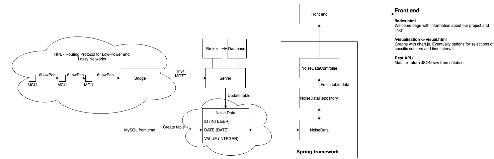

# The Team

We are a team of students studying Information and Communication Technology at KTH Royal Institute of Technology in Stockholm. 
We are currently taking the course [II1305 Project in Information and Communication Technology](https://www.kth.se/student/kurser/kurs/II1305), during which we are conducting a project.

## Internet of Noisy Things
We are developing a noise sensor network for [KTH Network Systems Lab](https://www.kth.se/cos/research/nslab).
The project goal is to design and implement a complete network of noise sensors including
- Input of data from noise sensors.
- Connecting noise sensors in a wireless sensor network.
- Storage and access of sensor data.
- Web interface for accessing and displaying sensor data.

We will also, time permitting
- Investigate server-side support for CoAP pubsub.
- Investigate alternative solutions for noise measurements.

## Team members
Anton Bothin abothin@kth.se  
Erik Flink erikfli@kth.se  
Nelly Friman nellyf@kth.se (Internal product owner)  
Jacob Klasmark jacobkl@kth.se  
Valter Lundegårdh valterlu@kth.se (Scrum Master)  
Isak Olsson isakol@kth.se  
Andreas Sjödin ansjod@kth.se  
Carina Wickström carinawi@kth.se  

If you have questions about the project, please contact our Scrum Master Valter Lundegårdh.

# Sprint 1: 23-29 April
Sprint Goal:
  - Design System & Prepare for development 

Sprint backlog (Estimates in paranthesis):
  - Linux + Toolchain (13)
  - Data design (8)
  - Database design (13)
  - Web page design (20)
  - Complete system design (8)
  
Estimated velocity (52)

Schedule:
  - Sprint Period: 2019.04.23-2019.04.29
  - Daily Scrum: 8:15 in 304
  - Sprint demo: 2019.04.29, 08:00 in Sal-B

# Flow-chart

# Sprint 2: 2-8 May
Sprint Goal:
  - SenML + CBOR Support 

Sprint backlog (Estimates in paranthesis):
  - SenML messages (13)
  - CBOR on sensors (40)
  - CBOR on server (8)
  - Design SenML API (8)
  - Implement SenML API (100)
  - Frontend API access (40)
  
Estimated velocity (209)

Schedule:
  - Sprint Period: 2019.05.02-2019.05.08
  - Daily Scrum: 8:15 in 304
  - Sprint demo: 2019.05.08, 08:00 in Sal-A

# Sprint 3: 9-15 May
Sprint goal: 
  - Finish SenML API and implement new front end feature.

Sprint backlog (Estimates in paranthesis):

## From Sprint 2 (20)
  - Tests for API 
  - Design senML API 
  - New microphone 
  - Implement senML API
  
## Sprint 3
  - Design senML decode API (20)
  - Look over documentation   (40)
  - Implment senML decode API on server (40)
  - Improve front end (13)
  - Live visualisation update (8)

Estimated velocity (240)

# Sprint 4: 16-22 May
Sprint goal: 
  - Finish implementing the API:s, clean up code, and prepare for the expo. 

Sprint backlog (Estimates in paranthesis):
  - Implement SenML decode API on server (40)
  - Implement SenML decode API on sensor (100)
  - Look over documentation   (40)
  - Evaluate CBOR (13)
  - Sliding window live update (5)
  - Implment senML decode API on server (40)
  - Code cleanup (8)
  - Github cleanup (8)
  
Estimated velocity (249)

Schedule:
  - Sprint Period: 2019.05.16-2019.05.22
  - Daily Scrum: 8:15 in 304
  - Sprint demo: 2019.05.08, 08:00 location TBA
